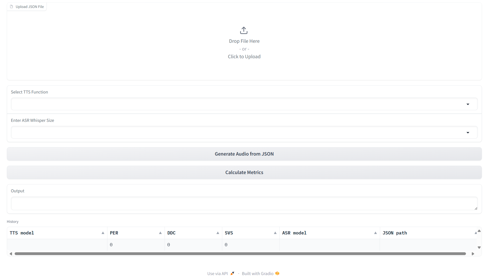

# TTS Model Evaluator

## Description:
This project contains a simple web interface to evaluate the performance of a TTS model on given dataset and produce the Phoneme Error Rate (PER) and Deepfake Detection Confidence (DDC) metrics.
The repository also contains several modern dockerized TTS models that can be easily built and run using the provided docker files.
## Metrics:
 - Phoneme Error Rate (PER): The PER is a metric that measures the difference between the phoneme sequence generated by the TTS model and the ground truth phoneme sequence. Since modern TTS models noramlly skip the phoneme generation step, the phoneme sequence is generated by first converting the generated speech to text using [Whisper](https://github.com/openai/whisper/tree/main) models and then converting the text to phonemes. The PER is calculated using the Levenshtein distance between the two sequences. The reason we don't use the WER metric is that the phoneme sequence is more informative in the context of TTS evaluation and it kinda mitigates the bias of the ASR model.
-  Deepfake Detection Confidence (DDC): The DDC is a metric that measures the confidence of a deepfake detection model in detecting the generated speech as a deepfake. Unfortunately, there lacks a good deepfake detection model for languages other than English. Experimented models include [HyperMoon/wav2vec2-base-960h-finetuned-deepfake](https://huggingface.co/HyperMoon/wav2vec2-base-960h-finetuned-deepfake); [abhishtagatya/wav2vec2-base-960h-itw-deepfake](https://huggingface.co/abhishtagatya/wav2vec2-base-960h-itw-deepfake); [Hemg/small-deepfake](https://huggingface.co/Hemg/small-deepfake); [motheecreator/Deepfake-audio-detection](https://huggingface.co/motheecreator/Deepfake-audio-detection); [MelodyMachine/Deepfake-audio-detection-V2](https://huggingface.co/MelodyMachine/Deepfake-audio-detection-V2); [DavidCombei/wavLM-base-DeepFake_UTCN](https://huggingface.co/DavidCombei/wavLM-base-DeepFake_UTCN).  
    
    [DavidCombei/wavLM-base-DeepFake_UTCN](https://huggingface.co/DavidCombei/wavLM-base-DeepFake_UTCN) is the best model we have found, so we use it as the default model to calculate the DDC for now.

    Consider finetuning new deepfake detection model on [MLAAD](https://deepfake-total.com/mlaad).

## Installation:
1. Clone the repository.
2. Create a conda environment using the provided environment.yml file, or install the required packages manually.
   
    ```bash 

        conda env create -f environment.yml
        conda activate eval
    ```

3. run the following command to start the web interface.
    ```bash
        python webUI.py
    ```

## Usage:
1. Open the web interface in your browser, the UI should look like this:
    
2. Upload a Custom Data Configuration File to the UI.
    The configuration file should be in JSON format, structured as follows:

    ```json
    [
        {
            "audio_path": "path/to/audio.wav",
            "transcription": "你好，我是一个TTS模型。"
        }
        // Add more samples to the list as needed.
    ]
    ```

    > Ensure that any audio data you have in the format of `(array, sampling rate)` is converted to `.wav` files before including them in the configuration file.
    > Each entry in the JSON array represents a single sample, with the `audio_path` pointing to the location of the `.wav` file and `transcription` containing the corresponding text.
    
    Then, click the **Generate Audio from JSON** button to upload the file.

3. Select the TTS function to generate the audio samples.
    We provide [vits-fast-finetuning](https://github.com/Plachtaa/VITS-fast-fine-tuning/tree/main) as an example. 
    To add more TTS models, implement your custom TTS function in the `api.py` file. The function should have the following signature:
    
    ```python

        def ur_fn(text: str) -> Tuple[np.ndarray, int]:
            """
            Args:
                text: The text to be synthesized.
            Returns:
                audio: The synthesized audio array.
                sampling_rate: The sampling rate of the audio.
            """

    ```
    Then, add the function to the `TTS_FNs` dictionary in the `api.py` file.

    ```python

        
        TTS_FNs = {call_vits_ft.__name__: call_vits_ft, ur_fn.__name__: ur_fn}

    ```

    Now, you can select the tts function from the dropdown menu in the UI.

4. Select the **Whisper** model size to use for the PER calculation. This should be done in the **Enter ASR Whisper Size** dropdown menu.
    > The corresponding Whisper model will be **downloaded automatically**.

    Then, click **Calculate PER** to calculate the PER for the generated audio samples against the ground truth wav files.

5. Click **Calculate DDC** to calculate the DDC for the generated audio samples.
    > By clicking the button, the [DavidCombei/wavLM-base-DeepFake_UTCN](https://huggingface.co/DavidCombei/wavLM-base-DeepFake_UTCN) model will be **downloaded automatically**.


## Dockerized TTS Models:
We provide several dockerized TTS models that can be easily built and run using the provided docker files.
By running a docker container, an API server will be started that can be used to generate audio samples from text.
Putting this API calling as TTS functions to the web interface, we can easily evaluate the TTS model performance on a given dataset.
 -  [vits-fast-finetuning](https://github.com/Plachtaa/VITS-fast-fine-tuning/tree/main) 
    1. go to `model_runner\vits-ft` directory.
    2. put your `G_latest.pth` and `modified_finetune_speaker.json` files (as named by the vits-ft project authors) in the `vits-ft` directory.
    3. build the docker image:
        ```bash
            docker build -t vits-ft .
        ```
    4. run the docker container:
        ```bash
            docker run -p 6969:6969 vits-ft 
        ```